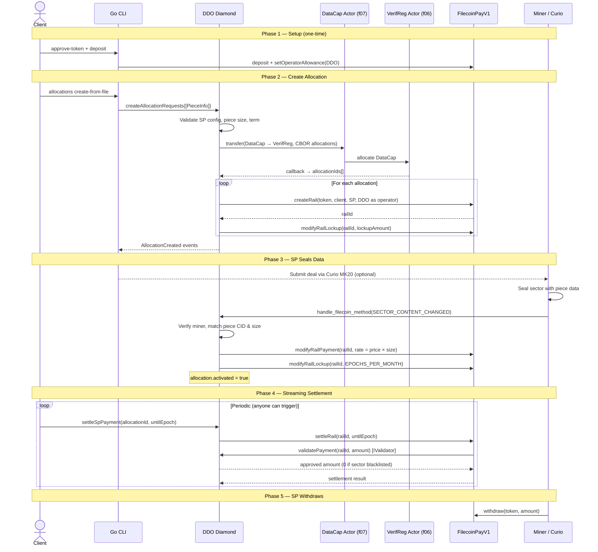

# DDO Client

Client software for **direct data onboarding on Filecoin** using smart contracts. This tool enables efficient data storage deals through blockchain-based automation, bypassing traditional market mechanisms for enhanced efficiency and cost savings.

## Overview

DDO (Decentralized Data Orchestration) Client provides a streamlined approach to Filecoin data onboarding through smart contract automation. It eliminates the complexity of traditional F05 market deals while providing customizable SLAs and automated payment processing.

## Key Features

- **Customizable SLAs and logic** through smart contract configuration
- **Stablecoin and native payments** support for flexible payment options
- **Monthly payment rails** directly between clients and storage providers
- **Reduced gas costs** compared to traditional F05 market deals
- **Diamond proxy pattern** (EIP-2535) for atomic, zero-downtime contract upgrades
- **Curio MK20 integration** with auto-discovery of SP endpoints from on-chain data
- **Comprehensive CLI** for seamless interaction with the protocol
- **Automated deal management** with configurable terms and conditions

## Project Structure

```
.
├── cmd/cli/main.go                      # CLI entry point
├── contracts/
│   ├── src/
│   │   ├── diamond/
│   │   │   ├── Diamond.sol              # EIP-2535 proxy — delegates calls to facets
│   │   │   ├── InitDiamond.sol          # Initializer (payments, commission, lockup)
│   │   │   ├── facets/
│   │   │   │   ├── AdminFacet.sol       # Owner-only config management
│   │   │   │   ├── AllocationFacet.sol  # Allocations, settlements, Filecoin callbacks
│   │   │   │   ├── SPFacet.sol          # SP registration, pricing, tokens
│   │   │   │   ├── ViewFacet.sol        # Read-only queries
│   │   │   │   ├── ValidatorFacet.sol   # Payment validation
│   │   │   │   ├── DiamondCutFacet.sol  # Upgrade operations
│   │   │   │   ├── DiamondLoupeFacet.sol# Introspection (EIP-2535)
│   │   │   │   ├── OwnershipFacet.sol   # Ownership transfer
│   │   │   │   └── mock/               # Test variants with mock behavior
│   │   │   ├── interfaces/              # IDiamondCut, IDiamondLoupe, IERC165
│   │   │   └── libraries/
│   │   │       ├── LibDDOStorage.sol    # Shared state, types, events, errors
│   │   │       ├── LibDiamond.sol       # Diamond storage and cut logic
│   │   │       └── VerifRegSerializationDiamond.sol
│   │   └── SimpleERC20.sol              # Test token
│   ├── script/
│   │   ├── DeployDiamond.s.sol          # Full diamond deployment
│   │   └── DeployPayments.s.sol         # Payments contract deployment
│   ├── shell/
│   │   └── setup.sh                     # Devnet setup (deploy, fund, grant DataCap)
│   ├── test/diamond/                    # Diamond-based test suite
│   └── foundry.toml
├── internal/
│   ├── commands/
│   │   ├── allocations/                 # create-from-file, query, query-claim-info
│   │   ├── sp/                          # register, list, settle, update, deactivate
│   │   ├── payments/                    # account, operator-approval, withdraw, etc.
│   │   └── admin/                       # Owner-only admin commands
│   ├── contract/
│   │   ├── ddo/                         # Go bindings for DDO Diamond
│   │   ├── payments/                    # Go bindings for Payments contract
│   │   └── token/                       # ERC20 interactions
│   ├── config/                          # Env var config loading
│   ├── curio/                           # Curio MK20 client, SP auto-discovery
│   ├── types/                           # Shared Go types
│   └── utils/                           # Payment setup, cost calculation
└── CLAUDE.md                            # AI assistant instructions
```

## Officially Deployed Contracts

### Filecoin Mainnet

| Contract              | Address                                      | Description                       |
| --------------------- | -------------------------------------------- | --------------------------------- |
| **DDO Contract**      | [`0x94A53ac3ca6743990ebB659F3Fe84198420d088c`](https://filecoin.blockscout.com/address/0x94A53ac3ca6743990ebB659F3Fe84198420d088c) | Diamond proxy (main entry point)  |
| **Payments Contract** | [`0x23b1e018F08BB982348b15a86ee926eEBf7F4DAa`](https://filecoin.blockscout.com/address/0x23b1e018F08BB982348b15a86ee926eEBf7F4DAa) | Payment processing and settlement |

### Filecoin Calibration Testnet

| Contract              | Address                                      | Description                       |
| --------------------- | -------------------------------------------- | --------------------------------- |
| **DDO Contract**      | [`0x889fD50196BE300D06dc4b8F0F17fdB0af587095`](https://filecoin-testnet.blockscout.com/address/0x889fD50196BE300D06dc4b8F0F17fdB0af587095) | Diamond proxy (main entry point)  |
| **Payments Contract** | [`0x09a0fDc2723fAd1A7b8e3e00eE5DF73841df55a0`](https://filecoin-testnet.blockscout.com/address/0x09a0fDc2723fAd1A7b8e3e00eE5DF73841df55a0) | Payment processing and settlement |

### Supported Tokens

| Token    | Symbol  | Network     | Address                                      |
| -------- | ------- | ----------- | -------------------------------------------- |
| **USDFC** | `USDFC` | Mainnet     | [`0x80B98d3aa09ffff255c3ba4A241111Ff1262F045`](https://filecoin.blockscout.com/address/0x80B98d3aa09ffff255c3ba4A241111Ff1262F045) |
| **USDFC** | `USDFC` | Calibration | [`0xb3042734b608a1B16e9e86B374A3f3e389B4cDf0`](https://filecoin-testnet.blockscout.com/address/0xb3042734b608a1B16e9e86B374A3f3e389B4cDf0) |

## Quick Start

### Prerequisites

- Go 1.22+
- [Foundry](https://book.getfoundry.sh/getting-started/installation)
- Access to a Filecoin node (devnet, calibration, or mainnet)

### Build

```bash
# Build CLI
go mod tidy
go build -ldflags="-s -w" -o ddo ./cmd/cli

# Build contracts
cd contracts && forge build
```

### Configure Environment

```bash
export DDO_CONTRACT_ADDRESS="0x..."
export PAYMENTS_CONTRACT_ADDRESS="0x..."
export RPC_URL="https://api.calibration.node.glif.io/rpc/v1"
export PRIVATE_KEY="your_private_key"
```

## Architecture



### Diamond Pattern (EIP-2535)

The DDO contract uses the Diamond proxy pattern where each 4-byte function selector is independently mapped to a facet address. This enables:

- **Full swap**: Replace all selectors of a facet at once
- **Partial swap**: Replace only some selectors while keeping others on the old facet
- **Mix & match**: Route different selectors to different facet versions
- **Add new functions**: Add brand new selectors pointing to any facet
- **Atomic**: All changes happen in a single `diamondCut()` transaction
- **Zero downtime**: Existing storage and state are preserved across upgrades

### Facets

| Facet | Selectors | Purpose |
|---|---|---|
| **AllocationFacet** | 4 | `createAllocationRequests`, `settleSpPayment`, `settleSpTotalPayment`, `handle_filecoin_method` |
| **ViewFacet** | 9 | `getAllSPIds`, `getAllocationIdsForClient`, `getAllocationIdsForProvider`, `allocationInfos`, `getAllocationRailInfo`, `getClaimInfo`, `getClaimInfoForClient`, `getDealId`, `getVersion` |
| **SPFacet** | 17 | SP registration, pricing, token management, queries |
| **AdminFacet** | 18 | Owner-only: set payments contract, commission, lockup, pause/unpause, blacklist, rescue FIL, read constants |
| **ValidatorFacet** | 2 | `validatePayment`, `railTerminated` |
| **DiamondCutFacet** | 1 | `diamondCut` — upgrade operations |
| **DiamondLoupeFacet** | 5 | Introspection: `facets`, `facetFunctionSelectors`, `facetAddresses`, `facetAddress`, `supportsInterface` |
| **OwnershipFacet** | 2 | `transferOwnership`, `owner` |

### Deploy Diamond

```bash
cd contracts

# Deploy payments contract first
forge script script/DeployPayments.s.sol \
  --rpc-url $RPC_URL --account <keystore-name> --broadcast --slow --gas-estimate-multiplier 100000

# Deploy Diamond with all facets
export DEPLOYER_ADDRESS="0x..."
export PAYMENTS_CONTRACT_ADDRESS="<address from above>"
forge script script/DeployDiamond.s.sol \
  --rpc-url $RPC_URL --account <keystore-name> --broadcast --slow --gas-estimate-multiplier 100000
```

> **Note:** Filecoin requires much higher gas estimates than Ethereum due to on-chain message storage costs. The `--gas-estimate-multiplier 100000` (1000x) accounts for this.

### Contract Testing

```bash
cd contracts

# Run all tests
forge test

# Run with verbosity
forge test -vvv

# Run specific test file
forge test --match-path test/diamond/DiamondAllocationTest.sol

# Run specific test function
forge test --match-test testCreateAllocation
```

## CLI Usage

### Storage Provider Management

```bash
# List all registered SPs
./ddo sp list --rpc $RPC_URL --contract $DDO_CONTRACT_ADDRESS

# Query a specific SP
./ddo sp query --actor-id 1002 --rpc $RPC_URL --contract $DDO_CONTRACT_ADDRESS

# Register a new SP (owner-only)
./ddo sp register \
  --actor-id 1002 \
  --payment-address 0x... \
  --min-piece-size 256 \
  --max-piece-size 34359738368 \
  --min-term 518400 \
  --max-term 5256000 \
  --token $TOKEN_ADDRESS \
  --price 105 \
  --rpc $RPC_URL --contract $DDO_CONTRACT_ADDRESS --private-key $PRIVATE_KEY

# Settle all active rails for a provider
./ddo sp settle --provider 1002 \
  --rpc $RPC_URL --contract $DDO_CONTRACT_ADDRESS --private-key $PRIVATE_KEY

# Deactivate an SP (owner-only)
./ddo sp deactivate --actor-id 1002 \
  --rpc $RPC_URL --contract $DDO_CONTRACT_ADDRESS --private-key $PRIVATE_KEY
```

### Create Allocations

The `create-from-file` command handles the full E2E flow:

1. Prepares data (generates piece CID, CAR file)
2. Calculates storage costs based on SP pricing
3. Sets up payments (deposits, operator approvals) automatically
4. Creates on-chain allocation via DataCap transfer
5. Optionally submits deal to Curio MK20 (pass `--curio-upload` to enable)

> **Note:** The CLI applies a **2x buffer** on required deposits and lockup allowances to ensure sufficient headroom for rate-based lockups and settlement timing. This is a conservative estimate that will be refined in future versions. Use `--skip-payment-setup` to bypass automatic setup if you prefer to manage payments manually.

```bash
./ddo allocations create-from-file \
  --input ./my-data.txt \
  --provider 1002 \
  --payment-token $TOKEN_ADDRESS \
  --rpc $RPC_URL \
  --contract $DDO_CONTRACT_ADDRESS \
  --payments-contract $PAYMENTS_CONTRACT_ADDRESS \
  --private-key $PRIVATE_KEY
```

#### Optional Flags

| Flag | Description |
|---|---|
| `--curio-upload` | Enable Curio MK20 deal submission after on-chain allocation (default: off, env: `CURIO_UPLOAD`) |
| `--curio-api URL` | Curio API URL (skips auto-discovery, env: `CURIO_API`) |
| `--skip-contract-verify` | Use `0xtest` address for Curio verification (devnet testing) |
| `--skip-payment-setup` | Skip automatic deposit/approval setup |
| `--dry-run` | Calculate costs without sending transactions |
| `--term-min N` | Minimum term in epochs (default: 518400) |
| `--term-max N` | Maximum term in epochs (default: 5256000) |
| `--expiration-offset N` | Expiration offset from current block (default: 172800) |
| `--buffer-type TYPE` | Buffer type: `local` or `lighthouse` (default: local) |
| `--buffer-api-key KEY` | Buffer service API key (for lighthouse) |
| `--buffer-url URL` | Buffer service base URL |
| `--download-url URL` | Override download URL for the piece |
| `--provider-fil-addr ADDR` | Override provider Filecoin address (e.g., t03123279) |

#### Using Lighthouse Buffer

For calibration/mainnet deployments with remote data hosting:

```bash
./ddo allocations create-from-file \
  --input /path/to/file \
  --provider 17840 \
  --payment-token 0xb3042734b608a1B16e9e86B374A3f3e389B4cDf0 \
  --buffer-type lighthouse \
  --buffer-api-key $LIGHTHOUSE_API_KEY \
  --buffer-url https://gateway.lighthouse.storage/ipfs/ \
  --rpc $RPC_URL \
  --contract $DDO_CONTRACT_ADDRESS \
  --payments-contract $PAYMENTS_CONTRACT_ADDRESS \
  --private-key $PRIVATE_KEY
```

### Query Allocations

```bash
# Query allocation details and rail info
./ddo allocations query --allocation-id 5 \
  --rpc $RPC_URL --contract $DDO_CONTRACT_ADDRESS

# Query allocations by client address
./ddo allocations query --client-address 0x... \
  --rpc $RPC_URL --contract $DDO_CONTRACT_ADDRESS

# Query claim info for a client
./ddo allocations query-claim-info \
  --client-address 0x... --claim-id 5 \
  --rpc $RPC_URL --contract $DDO_CONTRACT_ADDRESS
```

### Payments

```bash
# Query payment account info
./ddo payments account --address 0x... --token $TOKEN_ADDRESS \
  --rpc $RPC_URL --payments-contract $PAYMENTS_CONTRACT_ADDRESS

# Set operator allowance
./ddo payments set-operator-allowance \
  --operator $DDO_CONTRACT_ADDRESS \
  --rate-allowance 860160 \
  --lockup-allowance 6000000000000000000 \
  --rpc $RPC_URL --payments-contract $PAYMENTS_CONTRACT_ADDRESS --private-key $PRIVATE_KEY

# Withdraw funds
./ddo payments withdraw --token $TOKEN_ADDRESS --amount 1000000 \
  --rpc $RPC_URL --payments-contract $PAYMENTS_CONTRACT_ADDRESS --private-key $PRIVATE_KEY
```

### Admin Commands (Owner-Only)

```bash
# Set payments contract
./ddo admin set-payments-contract --address 0x... \
  --rpc $RPC_URL --contract $DDO_CONTRACT_ADDRESS --private-key $PRIVATE_KEY

# Set commission rate (basis points, max 100 = 1%)
./ddo admin set-commission-rate --bps 50 \
  --rpc $RPC_URL --contract $DDO_CONTRACT_ADDRESS --private-key $PRIVATE_KEY

# Set allocation lockup amount
./ddo admin set-lockup-amount --amount 1000000000000000000 \
  --rpc $RPC_URL --contract $DDO_CONTRACT_ADDRESS --private-key $PRIVATE_KEY

# Pause / unpause contract
./ddo admin pause --rpc $RPC_URL --contract $DDO_CONTRACT_ADDRESS --private-key $PRIVATE_KEY
./ddo admin unpause --rpc $RPC_URL --contract $DDO_CONTRACT_ADDRESS --private-key $PRIVATE_KEY
./ddo admin is-paused --rpc $RPC_URL --contract $DDO_CONTRACT_ADDRESS

# Blacklist a sector (blocks payment settlement for that sector)
./ddo admin blacklist-sector --provider 1002 --sector 42 \
  --rpc $RPC_URL --contract $DDO_CONTRACT_ADDRESS --private-key $PRIVATE_KEY

# Remove from blacklist
./ddo admin blacklist-sector --provider 1002 --sector 42 --remove \
  --rpc $RPC_URL --contract $DDO_CONTRACT_ADDRESS --private-key $PRIVATE_KEY

# Check if a sector is blacklisted
./ddo admin is-sector-blacklisted --provider 1002 --sector 42 \
  --rpc $RPC_URL --contract $DDO_CONTRACT_ADDRESS
```

### Token Approval

```bash
./ddo approve-token --token $TOKEN_ADDRESS --amount 1000000000000000000 \
  --rpc $RPC_URL --payments-contract $PAYMENTS_CONTRACT_ADDRESS --private-key $PRIVATE_KEY
```

## Curio MK20 Integration

Curio deal submission is **opt-in** — pass `--curio-upload` (or set `CURIO_UPLOAD=true`) to enable it. When enabled:

1. If `--curio-api` is not provided, the CLI auto-discovers the SP's Curio API URL from on-chain multiaddrs
2. After the on-chain allocation is created, the deal is submitted to Curio MK20
3. The CAR file is uploaded and finalized

**Auto-discovery** queries `Filecoin.StateMinerInfo` for the provider's on-chain multiaddrs, parses them looking for `/http` or `/https` endpoints, and falls back to extracting host:port from any multiaddr with `/ip4`, `/ip6`, or `/dns` + `/tcp` components.

## Complete Deal Flow

### End-to-End Process

1. **Setup**: Configure environment, get tokens, build CLI
2. **Register SP** (owner): Register storage provider with pricing and capacity config
3. **Approve Token** (one-time): Approve payment token for the payments contract
4. **Create Allocation**: Data prep, payment setup, on-chain allocation, Curio deal submission — all in one command
5. **SP Onboarding**: Curio seals the data into a sector and triggers `handle_filecoin_method` callback
6. **Activation**: The contract activates the payment rail when the sector is committed
7. **Settlement** (periodic): Anyone can trigger `settleSpPayment` or `settleSpTotalPayment` to transfer accrued payments
8. **Withdrawal**: SP withdraws earned payments from the payments contract

### Key Domain Concepts

| Concept | Description |
|---|---|
| **Allocation** | DataCap allocation linking a client's data piece to a storage provider via Filecoin's VerifReg actor |
| **Rail** | Streaming payment channel between client (payer) and SP (payee), operated by the DDO contract |
| **Settlement** | Transfer of accrued payments from client to SP based on elapsed epochs |
| **Diamond Cut** | Atomic operation to add/replace/remove function selectors in the Diamond proxy |
| **Epoch** | Filecoin block time (~30 seconds). `EPOCHS_PER_DAY = 2880`, `EPOCHS_PER_MONTH = 86400` |

## Environment Variables

| Variable | Required | Description |
|---|---|---|
| `DDO_CONTRACT_ADDRESS` | Yes | DDO Diamond proxy address |
| `PRIVATE_KEY` | For transactions | Wallet private key (with or without 0x prefix) |
| `RPC_URL` | No (default: localhost:8545) | Filecoin RPC endpoint |
| `PAYMENTS_CONTRACT_ADDRESS` | For payment ops | Payments proxy contract address |
| `BUFFER_API_KEY` | For lighthouse buffer | Lighthouse API key |
| `BUFFER_URL` | For lighthouse buffer | Lighthouse gateway URL |
| `CURIO_UPLOAD` | Optional | Set to `true` to enable Curio MK20 deal submission |
| `CURIO_API` | Optional | Override Curio MK20 API URL (skips auto-discovery) |

All env vars can be overridden with CLI flags (`--rpc`, `--contract`, `--private-key`, `--payments-contract`, etc.).
